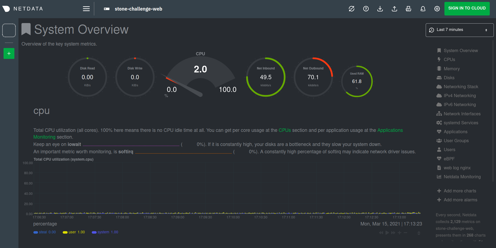
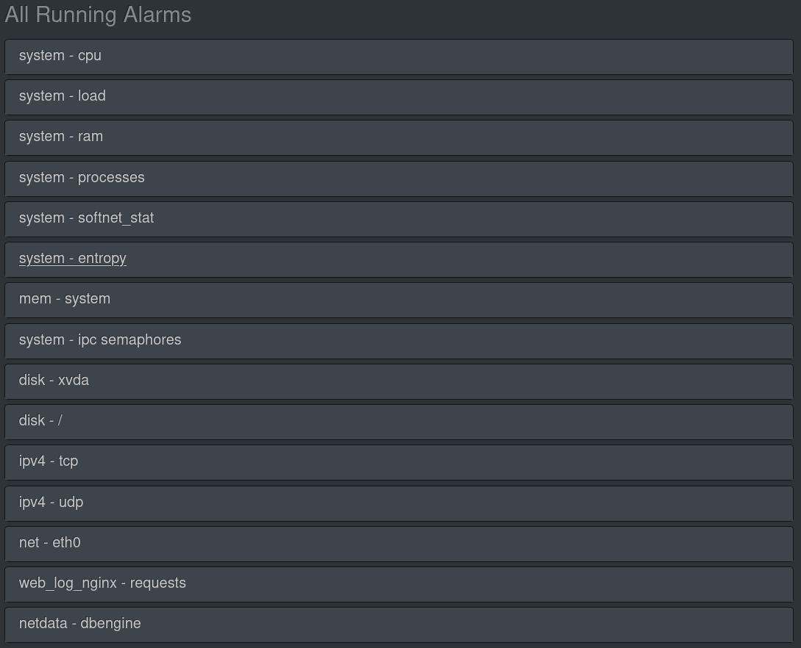
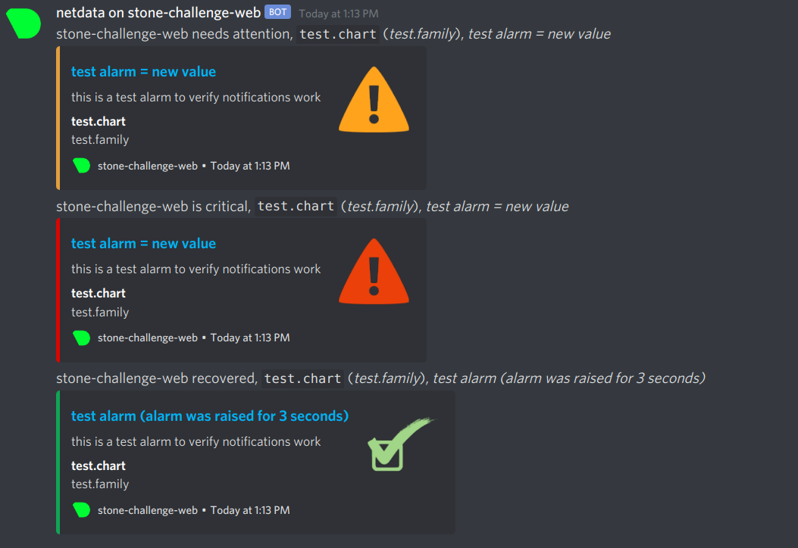
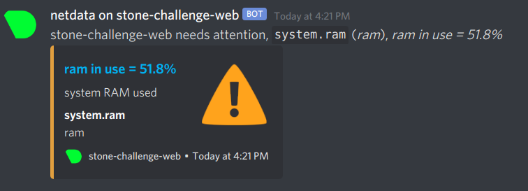

# Stone Challenge


Simple Netdata Dashboard running on t2.micro instance. The system presents the following features:
- Netdata Monitoring and Dashboard running on localhost:19999
- Nginx serving as a reverse proxy, exposing the dashboard to port 443
- Alarms sent to Discord over Webhook URLs

All infrastructure is managed by modules, which can be located at the ```modules``` dir and comprises
- test_vpc
- test_subnet
- test_sg (for the security group definitions)
- test_vm

For this particular use case, I've set a Discord Webhook URL and Recipient in order to receive my alarms, but you may use whichever tool suits you, such as Slack or Pushbullet (the user must provide a functioning health_alarm_notify.conf file, for that matter).

## Usage:

The user must provide a terraform.tfvars file containing their AMI credentials:

```bash
aws_access_key = "access_value"
aws_secret_key = "secret_value"
```

and a functioning health_alarm_notify.conf file containing their alarm recipient's info. Then, in order to spin up the web server, one must run:

```bash
terraform init
terraform apply --auto-approve
```

To spin up the web server. If all goes well, you shall receive a test alarm notification in your receiver.

In order to access the Netdata dashboard, one must fetch the Public IP from the web server instance:

```bash
terraform console <<< module.web_vm
{
  "web_ip" = "x.x.x.x"
}
```

and go to the http://x.x.x.x:443 address.

### Security Group

In order to keep it simple and effective, only three rules were implemented to the subnet's security group:

- One limiting SSH access to my local ISP CIDR block (which must be edited by the end user in the ```modules/test_sg/main.tf``` file).
- One exposing port 443 to the internet.
- One allowing all outward connections.

### SSH Access

A pair of SSH keys is generated and consumed by Terraform using AWS's resources. In order to keep the private key safe, the ```terraform.tfstate``` and ```terraform.tfstatebackup``` files were added to ```.gitignore```.

## Examples

### Netdata Dashboard

### Netdata Active Alerts

### Discord Alarm bot


